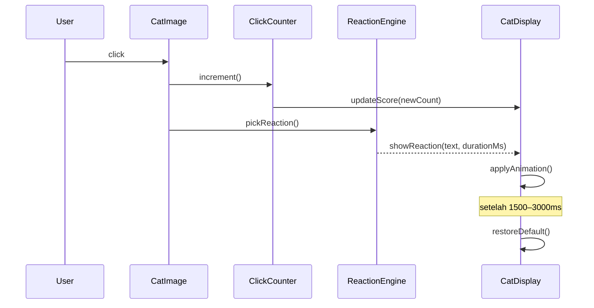

# Design Document — Cat Clicker App

## Overview

Cat Clicker App adalah Single Page Application (SPA) berbasis browser yang dibangun dengan **HTML5**, **Vanilla JavaScript (ES6+)**, dan **Tailwind CSS via CDN**. Aplikasi ini berjalan sepenuhnya di sisi klien tanpa server backend.

Pengguna melihat satu gambar kucing beserta namanya. Setiap kali gambar diklik, penghitung (click counter) bertambah satu dan sebuah reaksi teks ditampilkan selama 1500–3000 ms. Reaksi dipilih secara acak seragam dari Reaction Pool yang berisi 5–50 string unik. Animasi singkat CSS ditampilkan bersamaan dengan reaksi apabila browser mendukungnya.

Seluruh state (click counter, reaction pool, active reaction) hidup di memori JavaScript dan direset setiap kali halaman di-refresh — tidak ada penyimpanan persisten.

---

## Architecture

Aplikasi menggunakan **arsitektur single-page tanpa framework**, dengan pemisahan tanggung jawab melalui modul JavaScript terpisah.

```
index.html
  └── <script src="reaction-engine.js">   ← Reaction_Engine (logika acak, pool)
  └── <script src="app.js">               ← App controller (event listener, UI update)
  └── <link CDN Tailwind>
```

### Alur Eksekusi



### Prinsip Desain

| Keputusan | Alasan |
|---|---|
| Tidak ada framework JS | Sesuai requirement; menjaga bundle kecil dan kompatibilitas luas |
| Dua file JS terpisah | `reaction-engine.js` murni logika; `app.js` murni UI — mudah ditest secara terisolasi |
| Tailwind via CDN | Tidak perlu build step; sesuai requirement 5.3 |
| State di memori | Tidak ada requirement persistensi; refresh = reset sesuai requirement 1.5 |
| CSS animation via class toggle | Declarative, mudah di-disable untuk browser lama |

---

## Components and Interfaces

### 1. `ReactionEngine` (reaction-engine.js)

Modul pure-logic yang diekspor sebagai objek global `ReactionEngine`.

```javascript
/**
 * ReactionEngine
 * Bertanggung jawab atas manajemen Reaction_Pool dan pemilihan reaksi acak.
 */
const ReactionEngine = (() => {
  // Reaction_Pool: array string, 5–50 elemen, unik
  let pool = [
    "Purrr...", "Meow!", "Zzz...", "*ngintip*", "Hiss!",
    "Nom nom nom", "Mrrrow?", "*geleng-geleng*", "Blink blink", "Chirp!"
  ];

  /**
   * Mengembalikan satu reaksi acak seragam dari pool.
   * Jika pool kosong, mencatat error ke konsol dan mengembalikan null.
   * @returns {string|null}
   */
  function pick() { ... }

  /**
   * Mengembalikan jumlah reaksi yang tersedia.
   * @returns {number}
   */
  function size() { ... }

  /**
   * Mengembalikan salinan pool (untuk keperluan testing).
   * @returns {string[]}
   */
  function getPool() { ... }

  return { pick, size, getPool };
})();
```

**Kontrak:**
- `pick()` → string (salah satu elemen pool) atau `null` bila pool kosong
- Distribusi peluang seragam: `|P(item_i) - P(item_j)| < 0.01` untuk semua pasangan i, j
- Setiap elemen pool: panjang 1–100 karakter, unik

---

### 2. `App Controller` (app.js)

Mengatur DOM, event listener, dan siklus hidup tampilan reaksi.

```javascript
/**
 * App Controller
 * Menghubungkan ReactionEngine dengan DOM.
 */
const App = (() => {
  // State
  let clickCount = 0;           // integer, 0–999999
  let reactionTimer = null;     // setTimeout handle

  /** Inisialisasi: pasang event listener, render state awal */
  function init() { ... }

  /** Tangani klik pada Cat_Image */
  function handleCatClick() {
    // 1. increment counter (cap 999999)
    // 2. updateScore()
    // 3. pick reaction, showReaction() atau skip jika null
  }

  /** Perbarui Score_Display di DOM */
  function updateScore(count) { ... }

  /**
   * Tampilkan reaksi selama 1500ms, lalu kembali ke default.
   * Klik baru saat reaksi aktif: reset timer ke 1500ms dari klik baru.
   * @param {string} text
   */
  function showReaction(text) {
    // clearTimeout(reactionTimer) jika ada
    // tampilkan teks reaksi
    // toggle class animasi CSS
    // reactionTimer = setTimeout(restoreDefault, 1500)
  }

  /** Kembalikan Cat_Display ke tampilan default */
  function restoreDefault() { ... }

  return { init };
})();

document.addEventListener('DOMContentLoaded', App.init);
```

---

### 3. `index.html` — Struktur DOM

```html
<!DOCTYPE html>
<html lang="id">
<head>
  <meta charset="UTF-8">
  <meta name="viewport" content="width=device-width, initial-scale=1.0">
  <title>Cat Clicker</title>
  <script src="https://cdn.tailwindcss.com"></script>
</head>
<body>
  <!-- Cat_Display -->
  <div id="cat-display">
    <!-- Cat_Name -->
    <h1 id="cat-name">Whiskers</h1>

    <!-- Cat_Image (klikable) -->
    

    <!-- Reaction overlay (disembunyikan by default) -->
    <p id="reaction-text" aria-live="polite" hidden></p>

    <!-- Score_Display -->
    <p id="score-display">Klik: <span id="click-count">0</span></p>
  </div>

  <!-- Fallback untuk browser tanpa ES6 -->
  <noscript>
    <p>Browser Anda tidak mendukung JavaScript. Silakan gunakan browser modern seperti Chrome 80+, Firefox 75+, Edge 80+, atau Safari 13+.</p>
  </noscript>

  <script src="reaction-engine.js"></script>
  <script src="app.js"></script>
</body>
</html>
```

**Catatan aksesibilitas:**
- `aria-live="polite"` pada `#reaction-text` agar screen reader membacakan reaksi
- `alt` pada `Cat_Image` berisi nama kucing

---

## Data Models

### ClickCount

```
ClickCount ∈ ℤ
Invariant: 0 ≤ ClickCount ≤ 999999
Initial value: 0
Transition: ClickCount' = min(ClickCount + 1, 999999)  on each click
Reset: ClickCount = 0  on page refresh
```

### Reaction

```
Reaction : {
  text: string   // 1–100 karakter, tidak boleh kosong
}
```

### ReactionPool

```
ReactionPool : Reaction[]
Invariant: 5 ≤ |ReactionPool| ≤ 50
Invariant: ∀ i ≠ j, ReactionPool[i].text ≠ ReactionPool[j].text  (unik)
```

### ReactionPickResult

```
ReactionPickResult : string | null
- string  → reaksi terpilih (elemen dari ReactionPool)
- null    → pool kosong; tidak ada reaksi yang ditampilkan
```

### ActiveReaction

```
ActiveReaction : {
  text: string,          // teks yang sedang ditampilkan
  timerHandle: number,   // ID dari setTimeout
  startedAt: number      // Date.now() saat reaksi dimulai
} | null
```

Ketika `ActiveReaction` bukan `null`, klik baru akan:
1. Membatalkan `timerHandle` (clearTimeout)
2. Membuat `ActiveReaction` baru dari klik terbaru
3. Memulai timer baru 1500ms

---

## Correctness Properties

*A property is a characteristic or behavior that should hold true across all valid executions of a system — essentially, a formal statement about what the system should do. Properties serve as the bridge between human-readable specifications and machine-verifiable correctness guarantees.*

### Property 1: Klik meningkatkan counter tepat satu

*Untuk setiap* nilai ClickCount yang valid dalam rentang `[0, 999998]`, setelah tepat satu klik pada Cat_Image, nilai ClickCount SHALL bertambah tepat `1` (menjadi `n + 1`).

**Validates: Requirements 2.1**

---

### Property 2: Counter selalu berada dalam batas yang valid

*Untuk setiap* nilai ClickCount awal dalam rentang `[0, 999999]`, setelah satu klik, nilai ClickCount yang baru SHALL tetap berada dalam rentang `[0, 999999]` (tidak pernah negatif, tidak pernah melebihi 999999).

**Validates: Requirements 1.4**

---

### Property 3: Reaksi yang dikembalikan selalu berasal dari pool

*Untuk setiap* ReactionPool yang tidak kosong (berisi 1 atau lebih elemen), setiap pemanggilan `ReactionEngine.pick()` SHALL mengembalikan sebuah string yang merupakan elemen yang ada di dalam pool tersebut — tidak pernah string di luar pool, tidak pernah `undefined`.

**Validates: Requirements 2.3, 3.1**

---

### Property 4: Distribusi pemilihan reaksi mendekati seragam

*Untuk setiap* ReactionPool berukuran N (5 ≤ N ≤ 50), jika `pick()` dipanggil 10.000 kali, perbedaan frekuensi relatif antara elemen mana pun (|freq(i) − freq(j)|) SHALL tidak melebihi `1%`.

> *Catatan: Property 4 menggabungkan Requirements 2.3 dan 3.2 yang keduanya mendefinisikan distribusi seragam; tidak diperlukan property terpisah.*

**Validates: Requirements 2.3, 3.2**

---

### Property 5: Pool kosong dikembalikan sebagai null tanpa exception

*Untuk setiap* kondisi di mana ReactionPool kosong, pemanggilan `ReactionEngine.pick()` SHALL mengembalikan `null`, mencatat pesan error ke `console.error`, dan tidak melempar exception — sehingga caller tetap dapat berjalan normal.

**Validates: Requirements 2.6, 3.6**

---

### Property 6: Invariant elemen pool — panjang dan keunikan

*Untuk setiap* ReactionPool yang valid, semua elemen SHALL memenuhi dua invariant secara bersamaan:
- Panjang teks setiap elemen berada dalam rentang `[1, 100]` karakter
- Tidak ada dua elemen yang memiliki teks yang identik (`pool[i] !== pool[j]` untuk semua i ≠ j)

> *Catatan: Menggabungkan Requirements 3.4 (panjang) dan 3.1 (keunikan) menjadi satu property pool integrity karena keduanya adalah invariant struktural pool yang diperiksa bersamaan.*

**Validates: Requirements 3.1, 3.4**

---

### Property 7: Klik saat reaksi aktif mereset durasi tampil ke 1500ms

*Untuk setiap* keadaan di mana ActiveReaction sedang ditampilkan (pada waktu elapsed t mana pun, 0 ≤ t < 1500ms), sebuah klik baru SHALL membatalkan timer yang sedang berjalan dan memulai timer baru dengan durasi minimal `1500` milidetik — sehingga reaksi baru tidak akan menghilang lebih cepat dari 1500ms setelah klik terakhir.

**Validates: Requirements 2.5**

---

## Error Handling

| Kondisi Error | Komponen | Penanganan |
|---|---|---|
| ReactionPool kosong | ReactionEngine | `console.error(...)`, kembalikan `null`, click counter tetap bertambah |
| Browser tidak support ES6 | index.html | `<noscript>` menampilkan pesan fallback |
| Browser tidak support CSS animation | Cat_Display | Tidak ada animasi; reaksi teks tetap tampil (graceful degradation) |
| Cat_Image gagal dimuat | index.html | `onerror` handler menampilkan placeholder image atau teks alt |
| ClickCount sudah 999999 | App Controller | `Math.min(count + 1, 999999)` — tidak overflow, tidak crash |
| `showReaction` dipanggil saat reaksi aktif | App Controller | `clearTimeout(reactionTimer)` sebelum membuat timer baru |

---

## Testing Strategy

### Pendekatan Dual Testing

Pengujian menggunakan dua lapisan komplementer:

1. **Unit tests (example-based)** — menguji skenario konkret, edge case, integrasi antar komponen
2. **Property-based tests** — menguji properti universal di atas banyak input yang di-generate secara acak

### Library

| Layer | Library | Alasan |
|---|---|---|
| Unit + Property tests | [fast-check](https://github.com/dubzzz/fast-check) (JavaScript) | Mendukung PBT dengan arbitrary generators; berjalan di browser dan Node; tidak perlu build step tambahan |
| Test runner | [Vitest](https://vitest.dev/) atau `node --test` | Ringan, kompatibel dengan ES modules |

### Unit Tests (Example-Based)

- **ReactionEngine**
  - `pick()` dari pool berisi 1 elemen mengembalikan elemen tersebut
  - `pick()` dari pool kosong mengembalikan `null` dan memanggil `console.error`
  - `size()` mengembalikan panjang pool yang benar
- **App Controller**
  - Score_Display diperbarui segera setelah klik
  - `showReaction()` menyembunyikan teks setelah 1500ms (menggunakan fake timers)
  - Klik saat reaksi aktif mereset timer (clearTimeout dipanggil)
  - ClickCount tidak melewati 999999
- **DOM / Integration**
  - Halaman dimuat dengan score `0`
  - Klik gambar memicu penambahan score dan tampilnya reaksi

### Property-Based Tests

Setiap property test dikonfigurasi minimal **100 iterasi**. Tag format: `Feature: cat-clicker-app, Property {N}: {title}`.

| Property | Strategi Generator |
|---|---|
| P1: Klik meningkatkan counter tepat satu | `fc.integer({ min: 0, max: 999998 })` sebagai ClickCount awal |
| P2: Counter selalu berada dalam batas yang valid | `fc.integer({ min: 0, max: 999999 })` sebagai ClickCount awal |
| P3: Reaksi yang dikembalikan selalu berasal dari pool | `fc.array(fc.string({ minLength:1, maxLength:100 }), { minLength:1, maxLength:50 })` untuk pool tidak kosong |
| P4: Distribusi pemilihan reaksi mendekati seragam | `fc.integer({ min: 5, max: 50 })` untuk ukuran pool; jalankan 10.000 picks, cek max deviation < 1% |
| P5: Pool kosong dikembalikan sebagai null tanpa exception | Pool kosong (hardcoded `[]`); assert tidak throw, return null, console.error dipanggil |
| P6: Invariant elemen pool — panjang dan keunikan | `fc.uniqueArray(fc.string({ minLength:1, maxLength:100 }), { minLength:5, maxLength:50 })` |
| P7: Klik saat reaksi aktif mereset durasi tampil ke 1500ms | `fc.integer({ min: 0, max: 1499 })` sebagai elapsed time; simulasi klik, assert timer baru ≥ 1500ms |

### Aksesibilitas & Visual

- Verifikasi rasio kontras `#reaction-text` secara manual dengan browser DevTools (WCAG AA 4.5:1)
- Snapshot test layout pada viewport 320px, 768px, 1920px menggunakan Playwright atau screenshot manual
- Verifikasi kursor `pointer` pada Cat_Image via CSS inspection
